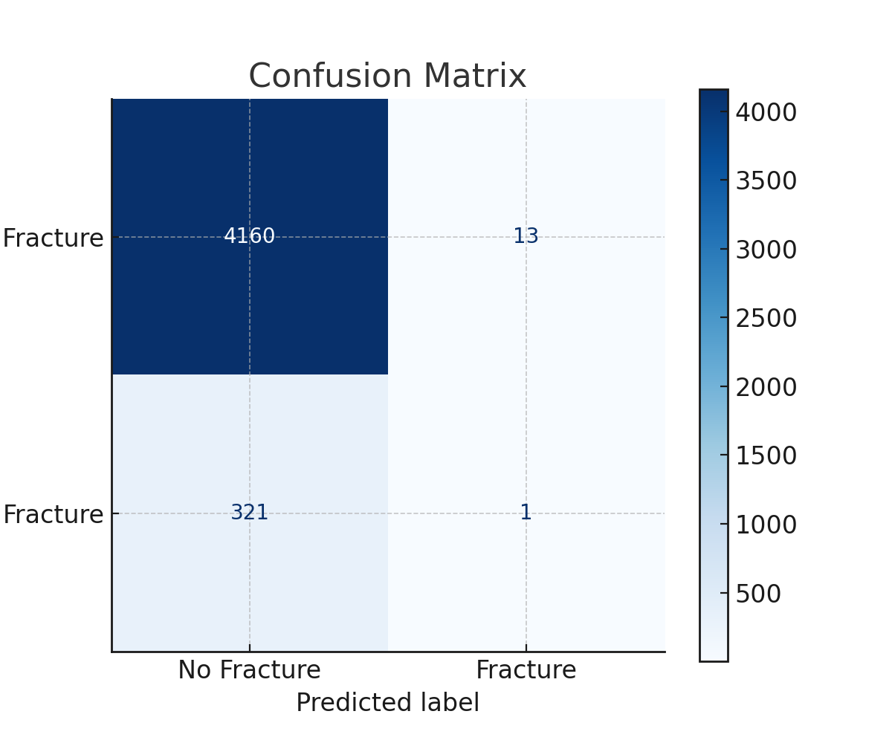

# Bone Fracture Risk Prediction Using Machine Learning

This project answers Can we predict the risk of a bone fracture based on age, alcohol, and calcium levels? 

---

##  Project Summary

- **Goal**: Predict fracture risk using medical and demographic variables
- **Dataset**: Multi-sheet Excel file including lab values, diagnosis codes, and patient age
- **Model**: Random Forest Classifier
- **Tools**: Python, Pandas, Scikit-learn, Seaborn, Matplotlib
- **Outcome**: Identified the limitations of using limited features and addressed class imbalance

---

##  Key Findings

- **Accuracy**: ~93% overall
- **Issue**: The model predicted non-fracture cases very well but **missed 99% of fracture cases**.
- **Cause**: Severe class imbalance and limited features
- **Next Steps**: Address imbalance with SMOTE or class weighting, and add clinical features like bone density or fall history.

---

##  Lessons Learned

- **Accuracy is not enough** — especially with imbalanced data.
- **Real-world datasets are messy and imbalanced**.
- **Healthcare predictions** require nuanced evaluation beyond simple metrics.

---

## Future Work

- Experiment with Logistic Regression and XGBoost  
- Add more medical features (e.g., bone density, fall risk, medications)

---

## Results & Visuals

### 🔹 Confusion Matrix

This matrix shows that while the model performs well for "no fracture" predictions, it fails to identify actual fracture cases accurately.

### 🔹 Feature Importance

This chart highlights that **age** and **calcium levels** are the most influential features in predicting bone fractures.

