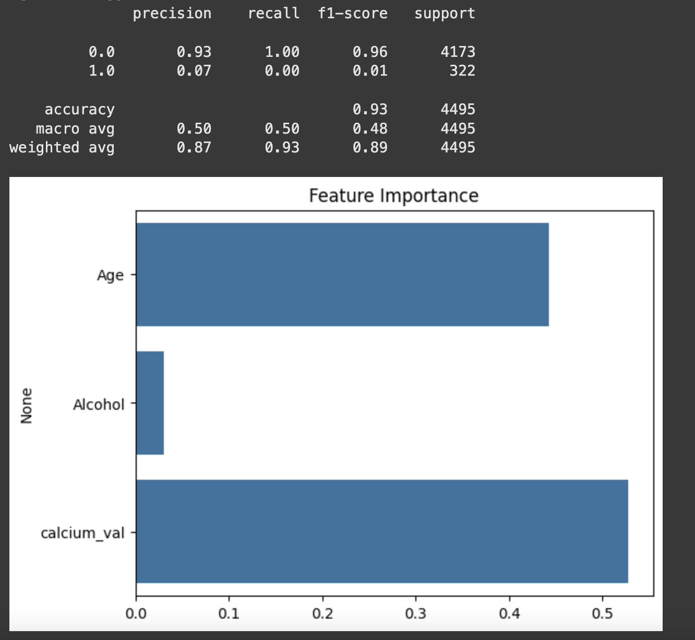

# Bone Fracture Risk Prediction Using Machine Learning

This project answers Can we predict the risk of a bone fracture based on age, alcohol, and calcium levels? 

---

##  Project Summary

- **Goal**: Predict fracture risk using medical and demographic variables
- **Dataset**: Multi-sheet Excel file including lab values, diagnosis codes, and patient age
- **Model**: Random Forest Classifier
- **Tools**: Python, Pandas, Scikit-learn, Seaborn, Matplotlib
- **Outcome**: Identified the limitations of using limited features and addressed class imbalance

---

##  Key Findings

- **Issue**: The model predicted non-fracture cases very well but **missed 99% of fracture cases**.
- **Cause**: Severe class imbalance and limited features
- **Next Steps**: Address imbalance with SMOTE or class weighting, and add clinical features like bone density or fall history.

---

##  Lessons Learned

- **Accuracy is not enough** — especially with imbalanced data.
- **Real-world datasets are messy and imbalanced**.
- **Healthcare predictions** require nuanced evaluation beyond simple metrics.

---

## Future Work

- Experiment with Logistic Regression and XGBoost  
- Add more medical features (e.g., bone density, fall risk, medications)

---

## Results & Visuals

After training the machine learning model with age, alcohol use, and calcium levels, we found that the model was really good at predicting people who did not have a bone fracture — it got those right almost every time. However, it did a poor job at identifying people who actually had fractures.

Out of 322 people who really had a fracture, the model only correctly predicted one of them. This means it missed almost every fracture case, which is a big problem. Even though the total accuracy was about 93%, that number is misleading — it's high only because the model guessed “no fracture” for almost everyone.

When we looked at which features the model used most, age and calcium levels were the most important, while alcohol use mattered less. But overall, these three features were not enough to build a reliable prediction model.

To make better predictions in the future, we should fix the problem of unbalanced data and add more health information — like bone scans, medication history, or past injuries — to help the model make smarter decisions.

## Confusion Matrix

---

###  Classification Report & Feature Importance

Below is the classification report and a bar chart showing which features mattered most to the model. Age and calcium levels were most important, while alcohol had a much smaller impact.

---
